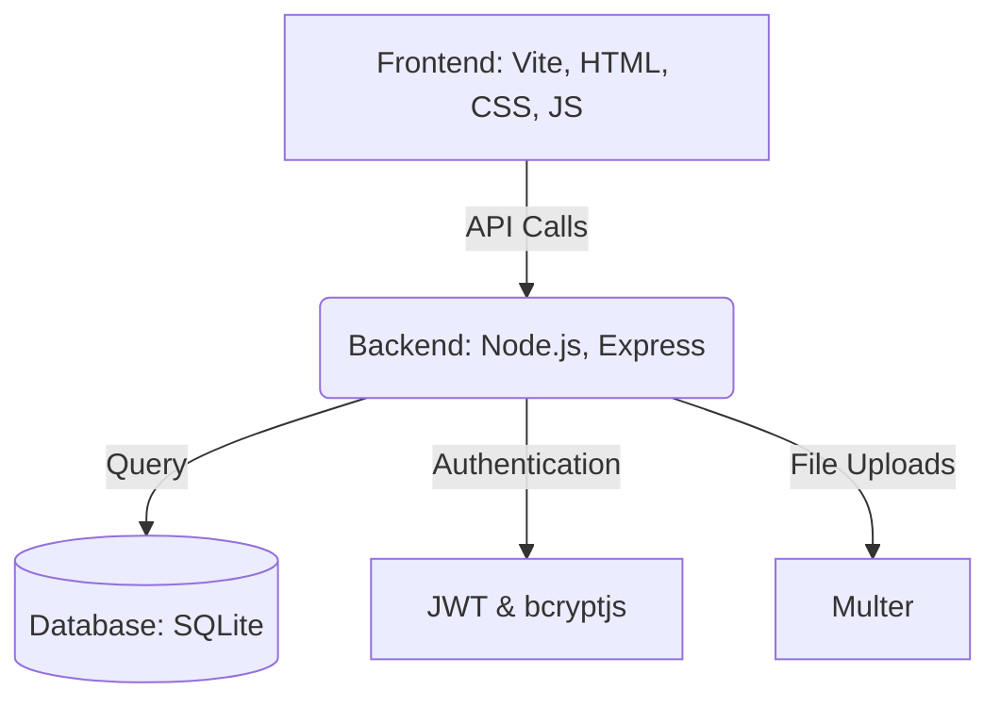

# Human Resource Management System (HRMS)

A modern Human Resource Management System (HRMS) developed for the **Odoo x Adamas Hackathon**. The application is designed to streamline and digitize essential HR operations, providing an efficient platform for employee management, attendance tracking, leave management, payroll, and profile administration.

## System Architecture



## Features

### Authentication
- Secure User Registration
- User Login
- Role-Based Access Control (Admin & Employee)
- JWT Authentication

### Dashboard
- Employee Dashboard
- Admin Dashboard
- Quick Statistics
- Recent Activities

### Employee Management
- Add Employee
- Edit Employee Details
- Delete Employee
- Employee Directory
- Employee Profile

### Attendance Management
- Daily Attendance
- Weekly Attendance
- Check-In / Check-Out
- Attendance History

### Leave Management
- Apply for Leave
- Leave Approval Workflow
- Leave History
- Leave Status Tracking

### Payroll Management
- Employee Salary View
- Payroll Management
- Salary Structure
- Monthly Payroll Records

### Profile Management
- View Profile
- Edit Personal Information
- Upload Profile Picture

---

## Tech Stack

### Frontend
- Vite
- HTML5
- CSS3
- JavaScript (ES6)

### Backend
- Node.js
- Express.js

### Database
- SQLite (better-sqlite3)

### Authentication
- JSON Web Token (JWT)
- bcryptjs

### Other Libraries
- Multer
- CORS

---

## Project Structure

```text
Human-Resource-Management-System/
│
├── server/
│   ├── db/
│   ├── middleware/
│   ├── routes/
│   ├── uploads/
│   └── index.js
│
├── src/
│   ├── components/
│   ├── pages/
│   ├── styles/
│   ├── utils/
│   ├── index.html
│   └── main.js
│
├── public/
├── package.json
├── vite.config.js
└── README.md
```

---

## Installation

Clone the repository:
```bash
git clone https://github.com/SomyadipJana/Odoo-x-Adamas.git
```

Move into the project folder:
```bash
cd Odoo-x-Adamas
```

Install dependencies:
```bash
npm install
```

Start the application:
```bash
npm run dev
```

The application will run at:
- Frontend: `http://localhost:5173`
- Backend API: `http://localhost:3001`

---

## User Roles

### Employee
- Login
- Manage Profile
- View Attendance
- Apply for Leave
- View Payroll

### Admin / HR
- Manage Employees
- Approve Leave Requests
- Manage Attendance
- Manage Payroll
- View Employee Detail

---

## Future Enhancements

- Email Verification
- Password Reset
- Notifications
- Performance Analytics
- Report Generation
- Multi-Department Support
- Calendar Integration

---

## License

This project was developed for educational purposes as part of the **Odoo x Adamas Hackathon**.

---

## Developed By

- **Soumyadip Jana**
- **Rikpriyo Dhali**
- **Sourav Das**

B.Tech Computer Science Engineering  
Adamas University
